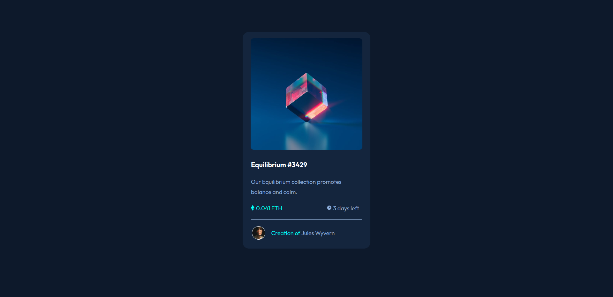

# Frontend Mentor - NFT preview card component solution

This is a solution to the [NFT preview card component challenge on Frontend Mentor](https://www.frontendmentor.io/challenges/nft-preview-card-component-SbdUL_w0U). Frontend Mentor challenges help you improve your coding skills by building realistic projects. 

## Table of contents

- [Overview](#overview)
  - [The challenge](#the-challenge)
  - [Screenshot](#screenshot)
  - [Links](#links)
- [My process](#my-process)
  - [Built with](#built-with)
  - [What I learned](#what-i-learned)
- [Author](#author)

**Note: Delete this note and update the table of contents based on what sections you keep.**

## Overview

### The challenge

Users should be able to:

- View the optimal layout depending on their device's screen size
- See hover states for interactive elements

### Screenshot

### Links

- Solution URL: [Solution URL](https://github.com/mue864/FrontEnd-Solutions/tree/main/nft-preview-card-component-main)
- Live Site URL: [Live Site](https://mue864.github.io/FrontEnd-Solutions/nft-preview-card-component-main/)

## My process

### Built with

- Semantic HTML5 markup
- CSS custom properties
- Flexbox
- CSS Grid

### What I learned

- I learned how to add overlay images to HTML elements.
- I also had the opportunity to master the z-index CSS property.
- I've continued to develop my skills in CSS and Flexbox. I've also    learned how to use the z-index CSS property to position elements.

## Author

- Frontend Mentor - [@mue864](https://www.frontendmentor.io/profile/mue864)