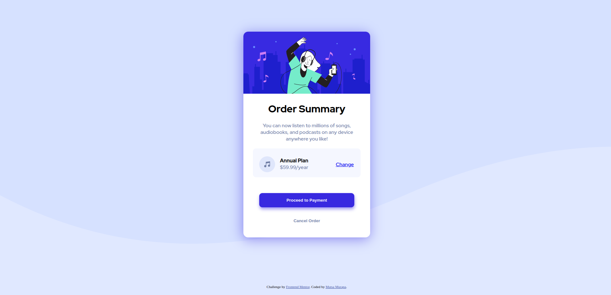

# Frontend Mentor - Order summary card solution

This is a solution to the [Order summary card challenge on Frontend Mentor](https://www.frontendmentor.io/challenges/order-summary-component-QlPmajDUj). Frontend Mentor challenges help you improve your coding skills by building realistic projects. 

## Table of contents

- [Overview](#overview)
  - [The challenge](#the-challenge)
  - [Screenshot](#screenshot)
  - [Links](#links)
- [My process](#my-process)
  - [Built with](#built-with)
  - [What I learned](#what-i-learned)
- [Author](#author)

## Overview

### The challenge

Users should be able to:

- See hover states for interactive elements

### Screenshot

### Links

- Solution URL: [Solution](https://github.com/mue864/FrontEnd-Solutions/tree/main/order-summary)
- Live Site URL: [Live Site](https://mue864.github.io/FrontEnd-Solutions/order-summary/)

## My process

### Built with

- Semantic HTML5 markup
- CSS custom properties
- Flexbox

### What I learned

- I learned how to use [Flexbox](https://css-tricks.com/snippets/css/a-guide-to-flexbox/) to create a responsive layout.
- I learned how to use CSS box-shadows to create a hover effect.

## Author

- Frontend Mentor - [@Mutsa Murapa](https://www.frontendmentor.io/profile/mue864)

