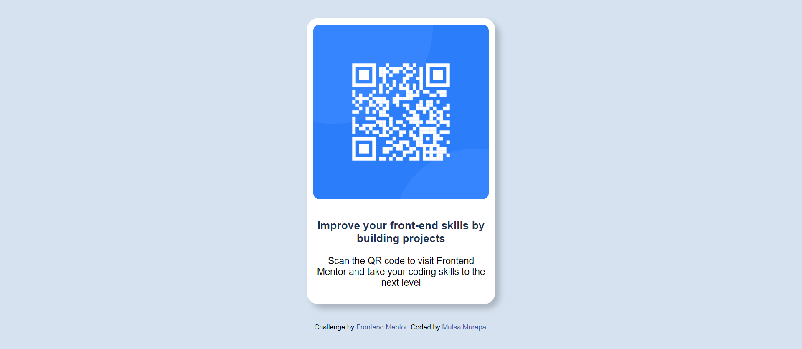

# Frontend Mentor - QR code component solution

This is a solution to the [QR code component challenge on Frontend Mentor](https://www.frontendmentor.io/challenges/qr-code-component-iux_sIO_H). Frontend Mentor challenges help you improve your coding skills by building realistic projects. 

## Table of contents

- [Overview](#overview)
  - [Screenshot](#screenshot)
  - [Links](#links)
- [My process](#my-process)
  - [Built with](#built-with)
  - [What I learned](#what-i-learned)
  - [Continued development](#continued-development)
  - [Useful resources](#useful-resources)
- [Author](#author)
- [Acknowledgments](#acknowledgments)

**Note: Delete this note and update the table of contents based on what sections you keep.**

## Overview

### Screenshot

### Links

- Solution URL: [Add solution URL here](https://your-solution-url.com)
- Live Site URL: [Add live site URL here](https://your-live-site-url.com)

## My process

### Built with

- Semantic HTML5 markup
- CSS
- Flexbox
- CSS Grid
- Mobile-first workflow

### What I learned
During the course of this project, I learnt new things such as Flexbox and CSS Grid. To be honest I didn't have any idea of how to align elements side by side with ease, this project helped me master the basics.

### Continued development
I think I would want to continue focusing on Flexbox, CSS Grid and responsive design, I'm starting to realize the importance of them, and only the basics wont help.

**Note: Delete this note and the content within this section and replace with your own plans for continued development.**

### Useful resources

(https://www.w3schools.com/howto/howto_css_cards.asp) - This helped me on how to create cards from scratch since I basically had no idea.

## Author

- Website - [Add your name here](https://www.your-site.com)
- Frontend Mentor - [@yourusername](https://www.frontendmentor.io/profile/yourusername)

